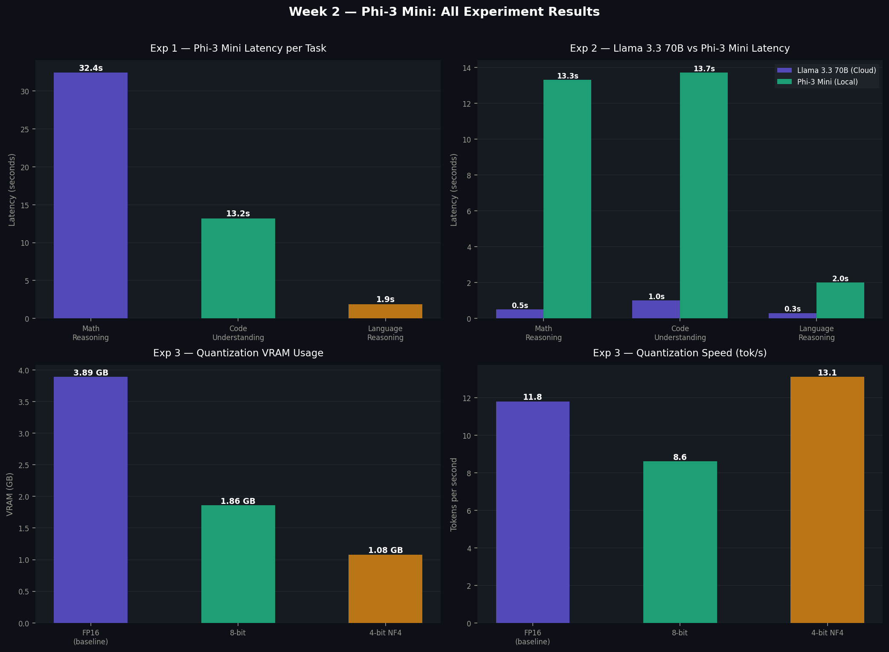

# Week 2 — Small Language Models: Experiments

**Series:** Weekly AI/ML Research | Week 2/12  
**Blog post:** [Small Language Models: Rethinking What Intelligence Actually Requires](https://dev.to/soohan_abbasi)  
**Author:** [Soohan Abbasi](https://www.linkedin.com/in/soohan-abbasi-36267b183/)

---

## Overview

This folder contains the experiments run for Week 2 of the weekly AI/ML research series. The topic is Small Language Models (SLMs) — what they are, how they work, and how they compare to large models in practice.

Three experiments were run on Kaggle using a T4 GPU:

| Experiment | Description |
|---|---|
| Experiment 1 | Phi-3 Mini local inference on 3 reasoning tasks |
| Experiment 2 | Llama 3.3 70B (Groq API) vs Phi-3 Mini head-to-head |
| Experiment 3 | Quantization comparison — FP16 vs 8-bit vs 4-bit NF4 |

---

## Results

### Experiment 1 — Phi-3 Mini Inference

| Task | Latency | Speed | Correct |
|---|---|---|---|
| Math reasoning (T-001) | 32.4s | 5.7 tok/s | Yes |
| Code understanding (T-002) | 13.2s | 19.3 tok/s | Yes |
| Language reasoning (T-003) | 1.9s | 19.2 tok/s | Yes |

### Experiment 2 — Llama 3.3 70B vs Phi-3 Mini

| Task | Llama 3.3 70B | Phi-3 Mini | Quality gap |
|---|---|---|---|
| Math reasoning | 0.5s (Cloud) | 13.3s (Local) | Minimal |
| Code understanding | 1.0s (Cloud) | 13.7s (Local) | Noticeable |
| Language reasoning | 0.3s (Cloud) | 2.0s (Local) | Minimal |

### Experiment 3 — Quantization Tradeoffs

| Config | VRAM | Latency | Speed |
|---|---|---|---|
| FP16 (baseline) | 3.89 GB | 16.9s | 11.8 tok/s |
| 8-bit | 1.86 GB | 23.1s | 8.6 tok/s |
| 4-bit NF4 | 1.08 GB | 13.9s | 13.1 tok/s |



---

## How to Run

### On Kaggle (recommended)

1. Open [Kaggle](https://kaggle.com) and create a new notebook
2. Enable GPU: Settings → Accelerator → T4 GPU
3. Upload `week2_slm_experiments.ipynb`
4. Add your Groq API key in the Experiment 2 cell
5. Run all cells

### Locally

```bash
pip install transformers==4.44.0 torch accelerate bitsandbytes groq matplotlib
jupyter notebook week2_slm_experiments.ipynb
```

Note: Experiment 1 and 3 require at least 8GB RAM (GPU recommended). Experiment 2 requires a free Groq API key from [console.groq.com](https://console.groq.com).

---

## Files

```
week02-slms/
├── week2_slm_experiments.ipynb   — main experiment notebook
├── week2_all_results.png         — results visualization
└── README.md                     — this file
```

---

## Key Findings

**Phi-3 Mini got every answer right** on all three test prompts despite being 18x smaller than Llama 3.3 70B. The quality gap showed up in explanation depth on the code task, not in correctness.

**8-bit quantization halved VRAM** (3.89 GB to 1.86 GB) with no noticeable quality loss. 4-bit NF4 reduced VRAM to 1.08 GB and was actually faster than FP16 on this task.

**The deployment tradeoff is real**: Llama 3.3 70B via Groq is 20-40x faster in latency. But Phi-3 Mini runs locally, costs nothing per query, and keeps data on-device.

---

## Test Prompts

Three manually crafted prompts were used rather than a standard benchmark dataset. This was a deliberate choice to observe model behavior on naturally phrased tasks. For rigorous evaluation, GSM8K (math reasoning) and HumanEval (code) would be more appropriate and are planned for a future week.

| ID | Type | Summary |
|---|---|---|
| T-001 | Math reasoning | Apple and orange purchase, change calculation |
| T-002 | Code understanding | Identify a Python function's purpose and spot a hidden bug |
| T-003 | Language reasoning | Extract the core argument from a technical paragraph |

---

## Dependencies

```
transformers==4.44.0
torch
accelerate
bitsandbytes
groq
matplotlib
```

---

*Part of the [weekly-AI-ML-research](https://github.com/soohanAbbasi/weekly-AI-ML-research) series.*
