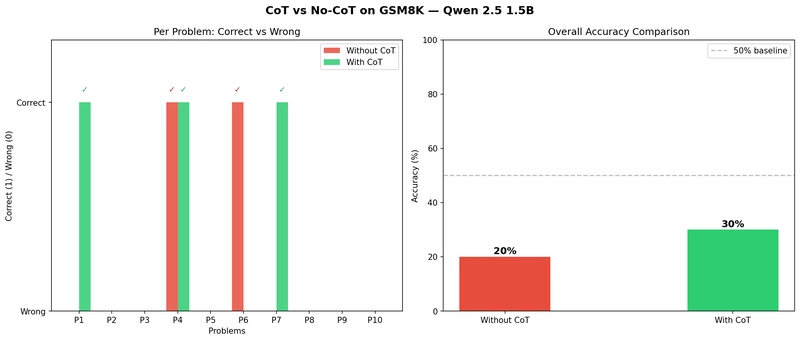

# Week 01: Chain-of-Thought and Beyond

**Blog Post:** [Read on Dev.to]()  
**Topic:** How LLMs Learn to Reason

---

## Experiment

Verified the CoT hypothesis from Wei et al. (2022) using Qwen 2.5 1.5B on 10 GSM8K problems.

| Approach | Correct | Accuracy |
|--|--|--|
| Without CoT | 2/10 | 20% |
| With CoT | 3/10 | 30% |

## How to Run

1. Open `cot_experiment.ipynb` on Kaggle
2. Enable GPU (T4 x1)
3. Run all cells

## Reference

Wei, J., et al. (2022). Chain-of-Thought Prompting Elicits Reasoning in Large Language Models. NeurIPS 2022.
